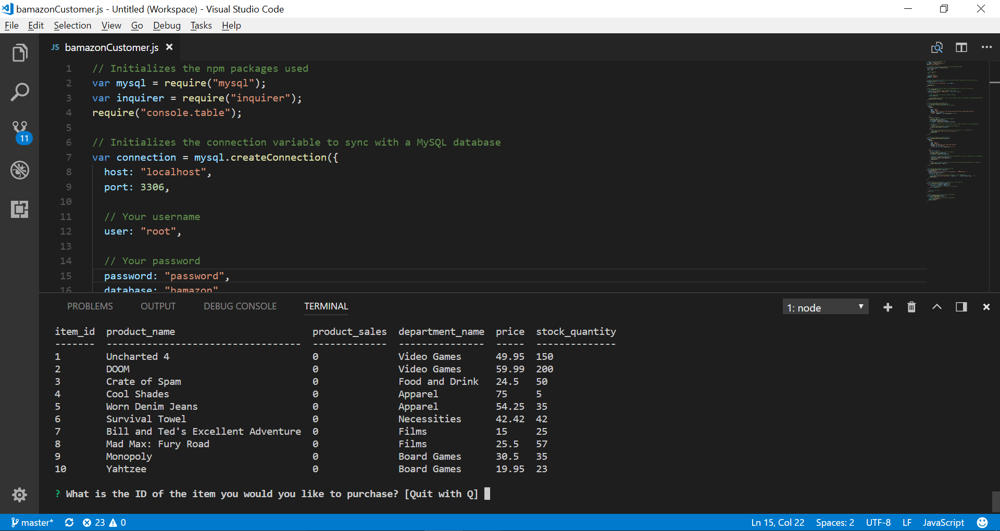
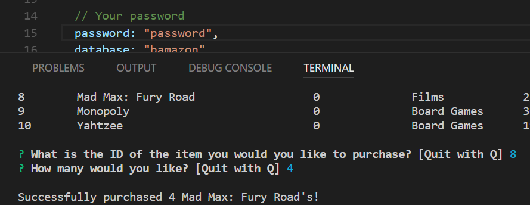
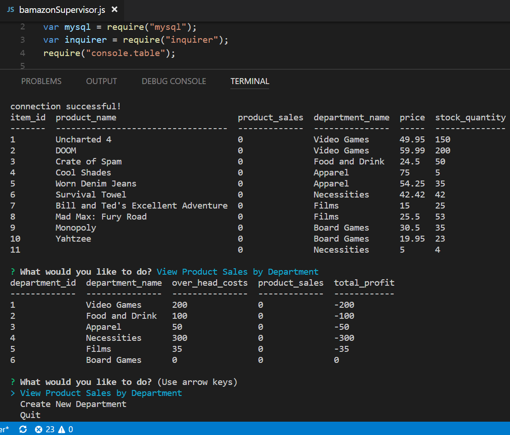
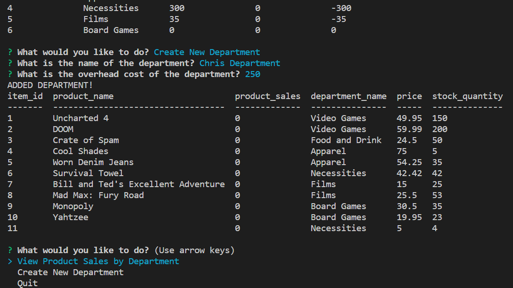
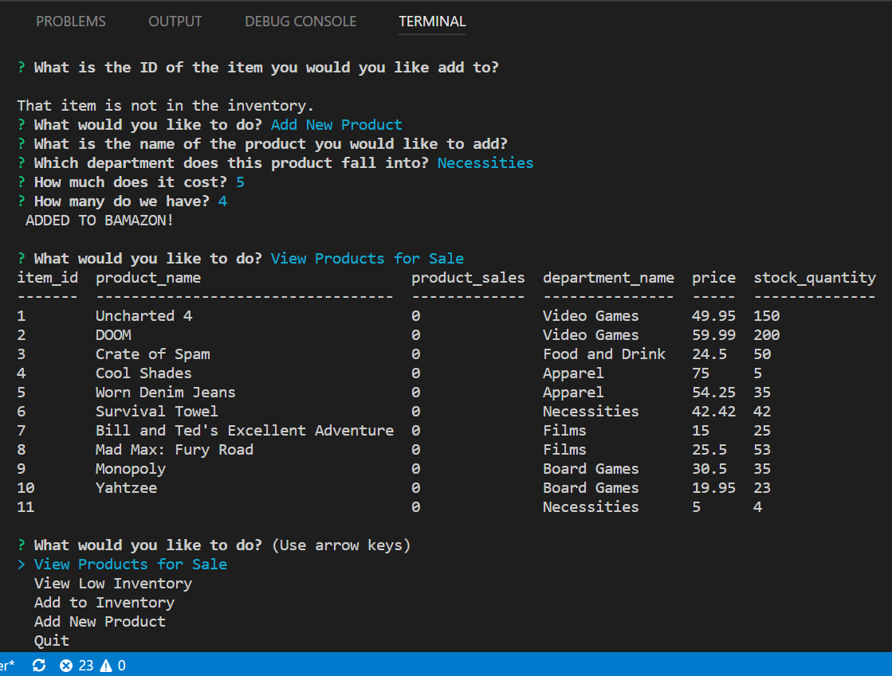

# Bamazon
Node.js &amp; MySQL Amazon-like storefront using MySql workbench and CLI

### Prerequisites
```
npm install mysql
  -https://www.npmjs.com/package/mysql
npm install inquirer
  -https://www.npmjs.com/package/inquirer
npm install console.table
  -https://www.npmjs.com/package/console.table
```
Download MySQL Workbench
Download the latest version of node

## Customer

Quickly prompted to type the ID of the item you would like to purchase and the amount



After information is sent recieve 
  -Successfully purchased 4 {product_name}!



## Supervisor

In Supervisor view you can view product sales by department 



and create a new department



## Manager

In Manager view user can:
  *View Products for Sale
  *View low inventory
  *Add to inventory
  *Add new Product
 


   *Updates real time on MySQL*
   
   

## Built With

* [VSCode](http://www.dropwizard.io/1.0.2/docs/) - Code Editor
* [Node](https://nodejs.org/en/) - Application runtime environment that allows you to write server-side applications in JavaScript
* [MySQL](https://www.mysql.com/products/workbench/) - Back-End Database


## Authors

* **Christopher Bermudez** - *Homework From* - 2017-2018 UCF Coding Bootcamp

## License

This project is licensed under the MIT License - see the [LICENSE.md](LICENSE.md) file for details
